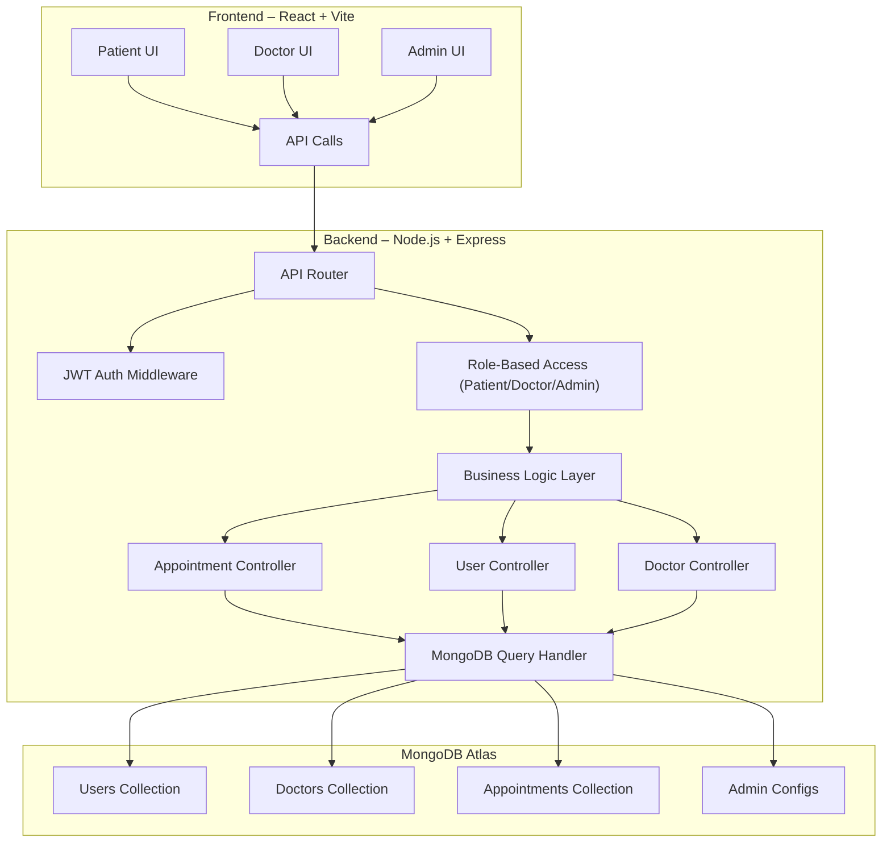

# Project Architecture

## 1. Overview

This document outlines the high-level architecture of the `BookMyDoc` project.

---

## 2. Architecture Diagram


---

## 3. Main Components

### a. Frontend

| Property         | Details                                                                                                                    |
| ---------------- | -------------------------------------------------------------------------------------------------------------------------- |
| Framework        | React                                                                                                                      |
| Responsibilities | - User authentication & authorization <br> - UI/UX rendering <br> - API communication with backend <br> - State management |

#

### b. Backend / API Server

| Property           | Details                                                                                                                                                           |
| ------------------ | ----------------------------------------------------------------------------------------------------------------------------------------------------------------- |
| Language/Framework | Node.js / Express                                                                                                                                                 |
| Responsibilities   | - Business logic <br> - RESTful or GraphQL API endpoints <br> - Authentication & session management <br> - Data validation <br> - Communicating with the database |

#

### c. Database

| Property         | Details                                                                        |
| ---------------- | ------------------------------------------------------------------------------ |
| Type             | MongoDB                                                                        |
| Responsibilities | - Store user data <br> - Store application data <br> - Maintain data integrity |

#

### d. Authentication

| Property         | Details                                                                                |
| ---------------- | -------------------------------------------------------------------------------------- |
| Method           | JWT, Session cookies                                                                   |
| Responsibilities | - Secure login/signup <br> - Token/session management <br> - Role-based access control |

#

### e. DevOps / Deployment

| Property         | Details                                                                                                         |
| ---------------- | --------------------------------------------------------------------------------------------------------------- |
| Tools            | GitHub Actions, Render                                                                                          |
| Responsibilities | - Automated testing & deployment <br> - Environment management (dev, staging, prod) <br> - Monitoring & logging |

---

## 4. Data Flow

1. **User interacts with the UI** (Frontend)
2. **Frontend sends API requests** to Backend
3. **Backend authenticates requests** and processes business logic
4. **Backend reads/writes data** from/to Database
5. **Backend sends response** to Frontend
6. **Frontend updates UI** for the user

---

## 5. Folder Structure

```
S73_Dhairya_Capstone_DABS/
├── backend/                              # Backend server - Node.js + Express + MongoDB
│   ├── config/
│   │   └── mongodb.js                    # MongoDB connection logic
│   ├── model/                            # Mongoose models
│   │   ├── appointmentModel.js
│   │   ├── doctorModel.js
│   │   └── userModel.js
│   ├── routes/                           # API routes
│   │   ├── appointmentRoutes.js
│   │   ├── doctorRoutes.js
│   │   └── userRoutes.js
│   ├── seedDemoUsers.js                  # Demo data seeding script (optional)
│   ├── server.js                         # Entry point of the backend server
│   ├── .env                              # Backend environment variables
│   ├── .gitignore
│   ├── package.json
│   └── package-lock.json
│
├── frontend/                             # Frontend app - React + Vite + Tailwind
│   ├── public/
│   ├── src/
│   │   ├── assets/                       # Static assets (e.g., logos, images)
│   │   ├── components/                   # Reusable UI components
│   │   │   ├── auth/                     # Login & Registration
│   │   │   │   ├── Login.jsx
│   │   │   │   └── Register.jsx
│   │   │   ├── dashboard/                # Dashboards by user role
│   │   │   │   ├── AdminDashboard.jsx
│   │   │   │   ├── DoctorDashboard.jsx
│   │   │   │   └── PatientDashboard.jsx
│   │   │   ├── Home.jsx
│   │   │   └── Navbar.jsx
│   │   ├── pages/                        # Route-level pages
│   │   │   ├── FindDoctors.jsx
│   │   │   └── Home.jsx
│   │   ├── App.jsx                       # Main app component
│   │   ├── App.css
│   │   ├── index.css
│   │   └── main.jsx                      # Entry point for React
│   ├── .env                              # Frontend environment variables
│   ├── .gitignore
│   ├── index.html
│   ├── package.json
│   ├── package-lock.json
│   ├── postcss.config.js
│   ├── tailwind.config.js
│   ├── vite.config.js
│   └── eslint.config.js
│
├── README.md                             # Project overview and setup guide
```

---

## 6. Technology Choices

| Category       | Technology Used  |
| -------------- | ---------------- |
| Frontend       | React            |
| Backend        | Node.js, Express |
| Database       | MongoDB          |
| Authentication | JWT              |
| CI/CD          | GitHub Actions   |
| Hosting        | Render           |

---

