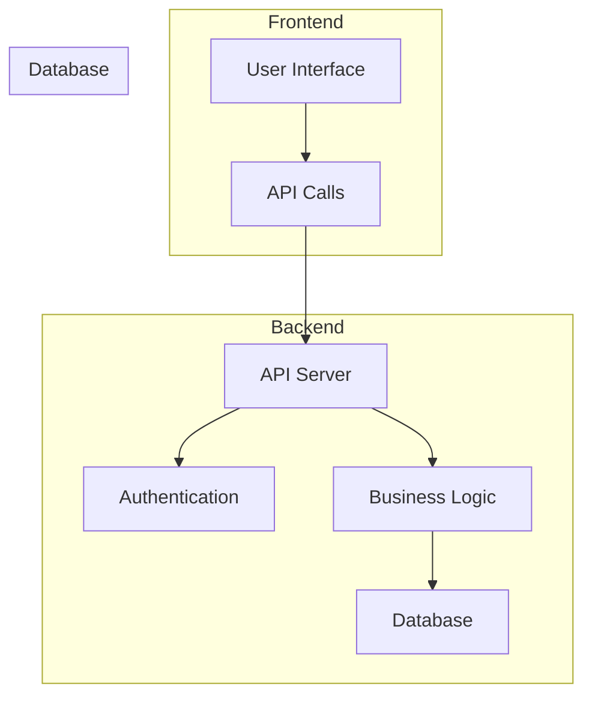

# Project Architecture

## 1. Overview

This document outlines the high-level architecture of the S73_Dhairya_Capstone_DABS project.

## 2. Main Components

### a. Frontend
- **Framework:** (React)
- **Responsibilities:**
  - User authentication & authorization
  - UI/UX rendering
  - API communication with backend
  - State management

### b. Backend / API Server
- **Language/Framework:** (Node.js/Express)
- **Responsibilities:**
  - Business logic
  - RESTful or GraphQL API endpoints
  - Authentication & session management
  - Data validation
  - Communicating with the database

### c. Database
- **Type:** (MongoDB)
- **Responsibilities:**
  - Store user data
  - Store application data
  - Maintain data integrity

### d. Authentication
- **Method:** (JWT, Session cookies)
- **Responsibilities:**
  - Secure login/signup
  - Token/session management
  - Role-based access control

### e. DevOps / Deployment
- **Tools:** (GitHub Actions, Render)
- **Responsibilities:**
  - Automated testing & deployment
  - Environment management (dev, staging, prod)
  - Monitoring & logging

---

## 3. Architecture Diagram



---

## 4. Data Flow

1. **User interacts with the UI** (Frontend)
2. **Frontend sends API requests** to Backend
3. **Backend authenticates requests** and processes business logic
4. **Backend reads/writes data** from/to Database
5. **Backend sends response** to Frontend
6. **Frontend updates UI** for the user

---

## 5. Folder Structure 

```
S73_Dhairya_Capstone_DABS/
├── backend/                              # Backend server - Node.js + Express + MongoDB
│   ├── config/
│   │   └── mongodb.js                    # MongoDB connection logic
│   ├── model/                            # Mongoose models
│   │   ├── appointmentModel.js
│   │   ├── doctorModel.js
│   │   └── userModel.js
│   ├── routes/                           # API routes
│   │   ├── appointmentRoutes.js
│   │   ├── doctorRoutes.js
│   │   └── userRoutes.js
│   ├── seedDemoUsers.js                  # Demo data seeding script (optional)
│   ├── server.js                         # Entry point of the backend server
│   ├── .env                              # Backend environment variables
│   ├── .gitignore
│   ├── package.json
│   └── package-lock.json
│
├── frontend/                             # Frontend app - React + Vite + Tailwind
│   ├── public/
│   ├── src/
│   │   ├── assets/                       # Static assets (e.g., logos, images)
│   │   ├── components/                   # Reusable UI components
│   │   │   ├── auth/                     # Login & Registration
│   │   │   │   ├── Login.jsx
│   │   │   │   └── Register.jsx
│   │   │   ├── dashboard/                # Dashboards by user role
│   │   │   │   ├── AdminDashboard.jsx
│   │   │   │   ├── DoctorDashboard.jsx
│   │   │   │   └── PatientDashboard.jsx
│   │   │   ├── Home.jsx
│   │   │   └── Navbar.jsx
│   │   ├── pages/                        # Route-level pages
│   │   │   ├── FindDoctors.jsx
│   │   │   └── Home.jsx
│   │   ├── App.jsx                       # Main app component
│   │   ├── App.css
│   │   ├── index.css
│   │   └── main.jsx                      # Entry point for React
│   ├── .env                              # Frontend environment variables
│   ├── .gitignore
│   ├── index.html
│   ├── package.json
│   ├── package-lock.json
│   ├── postcss.config.js
│   ├── tailwind.config.js
│   ├── vite.config.js
│   └── eslint.config.js
│
├── README.md                             # Project overview and setup guide

```

---

## 6. Technology Choices

- **Frontend:** (React)
- **Backend:** (Node.js/Express, JavaScript)
- **Database:** (MongoDB)
- **Auth:** (JWT)
- **CI/CD:** (GitHub Actions)
- **Hosting:** (Render)
      
---
